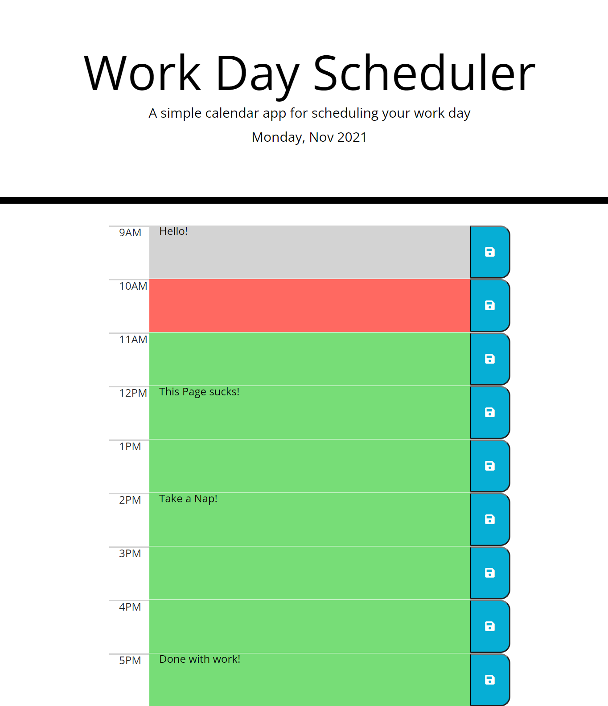

# Work Day Scheduler Starter Code

This webpage is a daily schedule keeper. It will let you add tasks to a normal 9-5 work day. Tasks that are past will show grey and the current task will be red, future tasks will show green. You can edit tasks and save them by pushing the save button. (So sorry for the "this page sucks" on the screen shot, I was frustrated with the code not working at that moment. I hope it made you laugh! haha)

<a href="https://kayceheap.github.io/Week5Challenge">Week 5 Challenge</a>